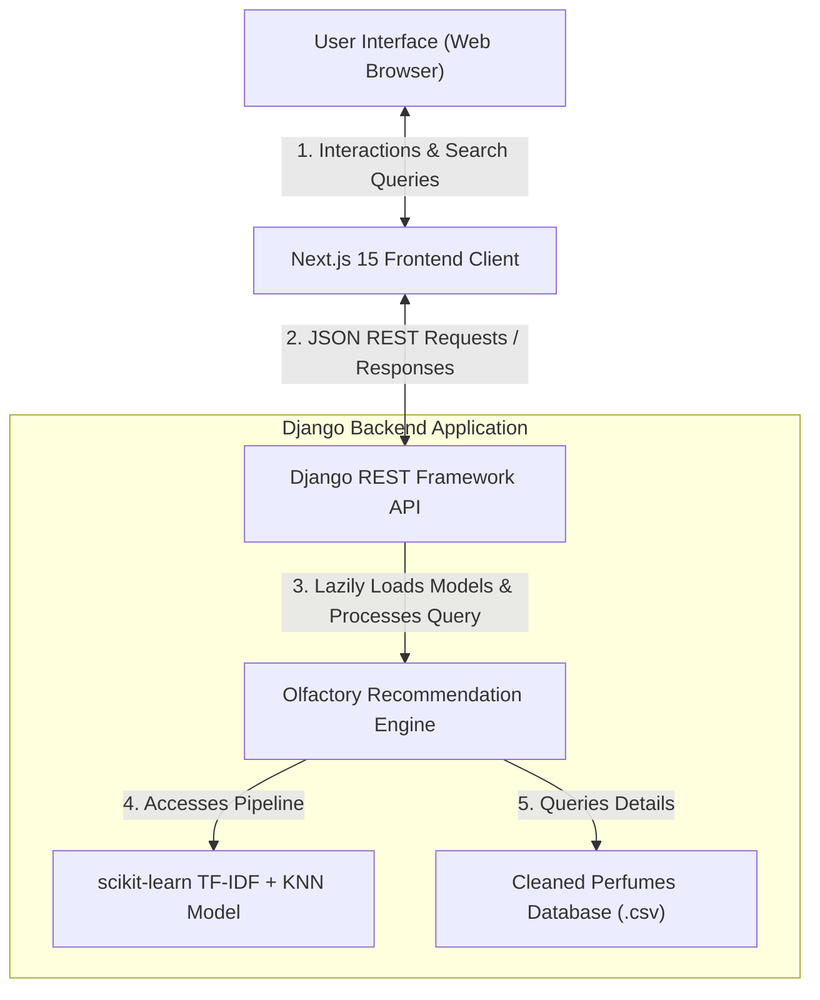
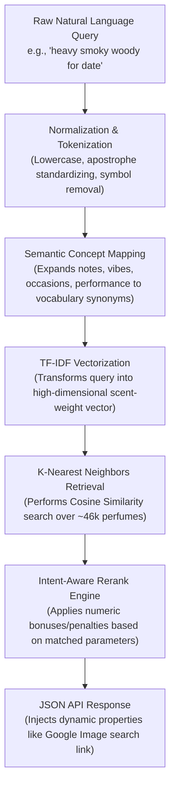

<h1 align="center">Sillage</h1>
<p align="center"><strong>AI-Based Perfume Recommendation System</strong></p>

<p align="center">
  <em>The scent trail continues.</em>
</p>

<p align="center">
  
  
  
  
  
  
  
</p>

---

## Overview

**Sillage 2.0** is an AI-powered fragrance discovery and recommendation web application. It translates raw, natural language user queries-describing moods, specific ingredients, times of year, or life occasions-into highly curated perfume suggestions from a database of over **46,000 scents**.

Instead of forcing users to navigate complex brand names or cryptic industry jargon, Sillage acts as a personal digital sommelier. Type a vibe like _"fresh clean laundry office scent"_ or _"warm, smoky vanilla for cold winter nights"_, and Sillage will immediately surface the most accurate matches matching your olfactory intent.

---

## Sillage 2.0 Architecture

Sillage 2.0 has migrated from a legacy monolithic Flask application into a high-performance, decoupled architecture. The frontend is built on a modern Next.js + React framework, communicating with a lightweight, robust Django REST Framework backend service hosting the lazy-loaded machine learning pipelines.

```
Sillage/
├── backend/                  # Django REST Framework Service
│   ├── config/               # Settings, routing, and server config
│   ├── recommendations/      # Core API endpoints & recommendation services
│   │   ├── services.py       # Thread-safe lazy model loading & retrieval
│   │   ├── views.py          # API handlers (GET / POST support)
│   │   └── serializers.py    # Request validation and serialization
│   ├── ml/                   # Machine learning entrypoints & model artifacts
│   │   └── train_model.py    # Vectorizer and KNN training scripts
│   └── requirements.txt      # Backend dependencies
│
├── frontend/                 # Next.js 15 Client Interface
│   ├── src/
│   │   ├── app/              # Next.js App Router (Layouts & Global CSS)
│   │   ├── components/       # UI elements (SearchBar, GenderToggle, Results list)
│   │   └── lib/              # Client-side API consumers
│   └── package.json          # Node dependencies & scripts
│
├── legacy_flask/             # Backup directory containing v1.0 source code
├── train_model.py            # Global ML training script wrapper
└── README.md                 # You are here
```

### System Flow Diagram



---

## Olfactory Search & Recommendation Pipeline

The recommendation engine in Sillage utilizes a unique multi-stage natural language processing (NLP) and vector retrieval pipeline designed to mimic human olfactory association.



### 1. Preprocessing & Semantic Expansion

When a user submits a search query, it is normalized to standard alphanumeric tokens. If the query represents a **vibe search**, Sillage maps recognized tokens to a rich dictionary of olfactory synonyms:

- **Ingredients (Notes)**: `mango` expands to `tropical`, `juicy`, `fruity`, `sweet`.
- **Vibe Aesthetics**: `sexy` expands to `sensual`, `seductive`, `date`, `night`.
- **Seasons/Monsoons**: `rainy` expands to `clean`, `green`, `watery`, `soft`, `musky`.
- **Occasions**: `office` expands to `clean`, `fresh`, `professional`, `safe`, `versatile`.
- **Performance Intent**: `beast mode` expands to `strong`, `powerful`, `loud`, `projection`, `sillage`.

### 2. Weighted Feature Engineering

Before training the vector space, we apply custom feature engineering. In the training file `train_model.py`, the metadata string is constructed by amplifying the signal of the notes:
$$\text{Metadata Blob} = \text{Name} + \text{Brand} + 3\times(\text{Notes}) + 3\times(\text{Accords}) + 2\times(\text{Season})$$
By repeating notes and accords three times, the vector space prioritizes **how the juice actually smells** over marketing terms or brand names.

### 3. K-Nearest Neighbors (KNN) Retrieval

Using the expanded query, the backend transforms the text using a pre-trained `TfidfVectorizer` (configured with `ngram_range=(1, 2)` to capture dual-phrase intents like "beast mode"). It then queries a `NearestNeighbors` model using a **Cosine Similarity** metric to gather the top candidate matches from the dataset.

### 4. Custom Intent-Aware Reranking

Once candidates are retrieved, a custom reranking function dynamically adjusts similarity scores to reward highly specific matches:

| Metric                     | Condition                                                                           | Score Boost / Penalty |
| -------------------------- | ----------------------------------------------------------------------------------- | --------------------- |
| **Exact Ingredient Match** | Query note matches candidate Top/Heart/Base notes                                   | **+0.22**             |
| **Broad Ingredient Match** | Query note synonym matches candidate accords/metadata                               | **+0.08**             |
| **Season Fit**             | Candidate season matches query intent                                               | **+0.09**             |
| **Occasion Alignment**     | Candidate occasion matches query intent                                             | **+0.07**             |
| **Vibe Match**             | Candidate metadata aligns with query aesthetics                                     | **+0.055**            |
| **VIP Brand Boost**        | Creed, Tom Ford, Amouage, Parfums de Marly, MFK, etc. (during luxury-intent search) | **+0.14**             |
| **Low-Tier Brand Penalty** | Zara, Avon, Oriflame, etc. (during luxury-intent search)                            | **-0.12**             |

---

## Premium Next-Gen Frontend UI

Sillage 2.0 features a gorgeous, bespoke web experience built on the philosophy of **luxury glassmorphism**:

- **Gender-Themed Ambient Glows**: Smooth background radial gradients that adapt visually to your active search settings (deep, luxurious blue glow for masculine searches, and soft, elegant rose-gold glow for feminine searches).
- **Cinematic Micro-Animations**: Interactive buttons, transitions, and hover-triggered glass overlays powered by **GSAP** (GreenSock Animation Platform) for native-feeling fluid motion.
- **Premium Typography**: Built using variable Google Fonts featuring _Playfair Display_ for the logo/headings and _Inter_ for legible metadata details.

---

## Quick Start Guide

Ready to get the scent trail running locally? Follow these steps to set up the decoupled Sillage 2.0 system:

### Prerequisites

- Python 3.10 or higher
- Node.js 18 or higher (with `npm`)

### 1. Spin up the Django Backend

Navigate into the backend directory, initialize your virtual environment, install dependencies, and launch the development API:

```bash
# Navigate to backend directory
cd backend

# Create and activate Python virtual environment
python -m venv .venv
# On Windows:
.venv\Scripts\activate
# On macOS/Linux:
# source .venv/bin/activate

# Install required dependencies
pip install -r requirements.txt

# Start the Django development server
python manage.py runserver 8000
```

The Django service runs locally at `http://127.0.0.1:8000/`.

> [!NOTE]  
> If model artifacts are missing, run the training pipeline first:
> `python manage.py shell -c "import train_model; train_model.train_and_save()"` or simply execute `python train_model.py` at the project root.

---

### 2. Launch the Next.js Frontend

In a separate terminal window, navigate to the frontend directory, install dependencies, and run the hot-reloading dev client:

```bash
# Navigate to frontend directory
cd frontend

# Install package dependencies
npm install

# Launch development environment
npm run dev
```

Open your browser and navigate to **[http://localhost:3000](http://localhost:3000)** to view the application.

---

## API Documentation

Sillage 2.0 exposes a clean search endpoint to run scent recommendations programmatically.

### Endpoint Details

- **URL**: `/api/search/`
- **Methods**: `GET` | `POST`
- **Content-Type**: `application/json` (for POST requests)

### Request Parameters

| Parameter | Type      | Required | Default | Description                                         |
| --------- | --------- | -------- | ------- | --------------------------------------------------- |
| `query`   | `string`  | **Yes**  | N/A     | Natural language vibe description or perfume name   |
| `gender`  | `string`  | No       | `None`  | Filter by target gender: `"Man"` or `"Women"`       |
| `limit`   | `integer` | No       | `5`     | Maximum number of records to return (capped at 100) |

### Sample Response (`GET /api/search/?query=rose+vanilla&gender=Women&limit=2`)

```json
{
  "query": "rose vanilla",
  "gender": "Women",
  "limit": 2,
  "results": [
    {
      "index": 1284,
      "perfume_name": "Velvet Rose & Oud",
      "brand": "Jo Malone",
      "gender": "for women and men",
      "season": "Winter",
      "cosine_distance": 0.482,
      "similarity": 0.518,
      "is_vip": true,
      "matched_note_terms": ["rose", "vanilla"],
      "matched_vibe_terms": ["warm", "sweet"],
      "matched_season_terms": ["winter"],
      "luxury_boost_applied": 0.06,
      "final_score": 1.073,
      "image_search_url": "https://www.google.com/search?q=Jo+Malone+Velvet+Rose+%26+Oud+perfume+bottle"
    }
  ]
}
```

---

## Dataset & Model Details

The intelligence layer of Sillage is built on top of a Kaggle Fragrantica dataset containing details on over **46,000 unique perfumes**:

- **Raw Dataset (`fra_perfumes.csv`)**: Features raw text scraped from perfume catalogs, detailing fragrance notes (top, middle, base), accords, descriptions, and ratings.
- **Cleaning Pipeline (`prepare_data.py`)**:
  - Standardizes text and fixes title encoding/format issues.
  - Automatically extracts missing brands and notes from descriptive paragraphs using regex patterns.
  - Heuristically infers the most suitable season and time-of-day based on the note pyramid (e.g. citrus notes default to summer/day, amber/oud default to winter/night).
  - Filters out obscure fragrances with fewer than 5 ratings to maintain the quality and relevance of recommendations.
- **Model Pipeline (`train_model.py`)**: Exports three core `.joblib` files to serve real-time API requests:
  - `perfumes_df.joblib`: Contains the serialized Pandas dataframe.
  - `perfumes_tfidf.joblib`: The trained vectorization configuration.
  - `perfumes_knn.joblib`: The structured index for high-speed cosine similarity.

---

## Legacy v1.0 Setup

If you wish to run the original Flask-based monolithic setup, you can do so directly from the root folder:

```bash
# Install base requirements
pip install flask pandas numpy scikit-learn joblib

# Run the Flask entrypoint
python app.py
```

Open **[http://127.0.0.1:5000](http://127.0.0.1:5000)** to experience the monolithic version. Backed-up files are stored safely within `/legacy_flask/`.

---

## Future Roadmap
- [ ] **User Profiles & Relational Storage**: Migrate to PostgreSQL to support user profile registrations, fragrance favorites, and history tracking.
- [ ] **Olfactory Engine Accuracy**: Fine-tune TF-IDF term weights and similarity functions to yield even higher precision recommendation outputs.
- [ ] **Up-to-Date Fragrance Catalogs**: Ingest newer and globally diverse fragrance catalogs, focusing on up-to-date niche releases and legendary Middle Eastern scent collections.
- [ ] **Cross-Platform Mobile Application**: Expand the ecosystem with native Android and iOS apps built with Flutter.

---

## Author

<p align="center">
  <strong>Navid Zaman Khan</strong>
</p>

<p align="center">
  <em>"A perfume is like a piece of clothing, a message, a way of presenting oneself, a costume that differs according to the woman or man who wears it."  ~ Paloma Picasso</em>
</p>

<p align="center">
  <a href="https://github.com/NavidZamanKhan"></a>
</p>
